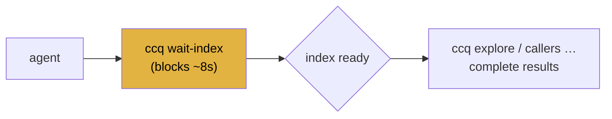

# Case Study — Index control on a big repo (filter · wait-index · cache · doctor)

The workflow that matters once a repo is **large** and an **agent** is driving: narrow what gets
indexed, *know* when the index is ready before querying, and keep the on-disk caches in check.
Everything below is **real output** (run on **redis**, 357 TUs / 792 files); §6 records the bug this
exercise's CI run caught.

Complements the other case studies (this one is the operations dimension):
[call-graph](../call-graph-redis-wpa/README.md) · [safe-refactor](../safe-refactor/README.md) ·
[intranet-no-build](../intranet-no-build/README.md) · [multi-target-compdb](../multi-target-compdb/README.md).

---

## 1. `ccq doctor` — is the environment sane?

Start here when something looks off:

```console
$ ccq doctor
ccq doctor

  ccq version : ccq 0.5.0
  OS / arch   : darwin/arm64
  project (-p): …/redis
  clangd      : ✓ /usr/bin/clangd
                Apple clangd version 17.0.0 (clang-1700.0.13.5)
  config      : (none) — all files indexed (no allow/deny filter)
  compile DB  : ✓ compile_commands (357 entries)
  cache (ccq) : 6.4M total at ~/Library/Caches/ccq
  clangd index: 6.4M at …/redis/.cache/clangd  (shared with VS Code / editor clangd)
  daemon      : not running
```

One screen: versions, the resolved clangd, the effective config (+ any regex errors), the compile-DB
mode and entry count, cache sizes, and daemon state — with fix-it hints when clangd is missing, there's
no compile DB, or the config has an error.

## 2. Narrow the index — `ccq.json` allow/deny

On a huge tree, index only what you care about. A `ccq.json` (project root, or `~/.config/ccq/`, or
`--config`) with **regex** allow/deny:

```json
{ "allow": ["^src/"], "deny": ["^src/commands/"] }
```
```console
$ ccq config
config: …/redis/ccq.json
  allow: [^src/]
  deny:  [^src/commands/]
```

The filter is **global**: it gates `OpenAll` (what clangd opens), the fn-pointer scan, `export` —
**and** the compile database handed to clangd (so its background index obeys it too; see §6). A
different filter gets its **own** warm daemon.

## 3. Know the index is ready — `ccq wait-index`

The trap for an agent: query *while clangd is still indexing* → partial results (a few callers
missing). `ccq wait-index` blocks until the index is actually complete:

```console
$ ccq wait-index
index ready: compile_commands, 792 files          # ~8s cold; returns only when done

$ ccq status
daemon: running — index ready (compile_commands, 792 files)
```

It works because the daemon only starts listening **after** `WaitIndex` (which waits for clangd's
`$/progress` *end*, not a timeout). For an agent: **run `ccq wait-index` once, then query** — the
results are complete. `--background` returns immediately and `ccq status` reports `indexing…` until
ready; `--rebuild` forces a fresh index.



## 4. Keep caches in check — `ccq cache`

Indexes pile up (clangd's is the big one). Observe and clean them:

```console
$ ccq cache
KIND          MODE                 SIZE  MODIFIED          PROJECT
daemon        compile_commands     310B  2026-06-29 08:11  …/redis [running]
daemon        compile_commands     311B  2026-06-29 06:54  …/ctest8
clangd-index                        5K  2026-06-29 06:48  …/ctest8
clangd-index                      6.4M  2026-06-26 22:08  …/redis
total: 6.4M. note: clangd-index is shared with editors (VS Code).

$ ccq cache clean --older-than 14          # drop stale daemon/compdb caches
$ ccq cache clean --project …/redis --index  # also clear redis's clangd index (warns: shared with VS Code)
```

`cache list` shows each cache's project, size, date and whether the daemon is running; `clean` takes
`--all | --project p | --older-than N`, and `--index` is required to touch `.cache/clangd` (because
it's **shared with your editor's clangd** — clearing it makes the editor re-index too).

## 5. The agent recipe

```bash
ccq doctor                 # sanity-check setup (once)
ccq wait-index             # block until the index is complete
ccq explore <symbol>       # …now query — results are complete
# housekeeping, occasionally:
ccq cache clean --older-than 14
```

## 6. Findings — the bug CI caught ✅

**🐛 The allow/deny filter didn't reach clangd's background index.** The filter gated ccq's
`OpenAll` (the *dynamic* index), but with a `compile_commands.json` clangd *also* background-indexes
every TU in the database — so a **denied** file still got indexed and its symbols still resolved.
Local clangd 17 didn't surface it (timing); **CI's clangd 18 did** (`TestConfigDenyFilter` failed).
**Fixed** (`compdb.ApplyFilter`): when a filter is active, ccq stages a `compile_commands.json` with
denied entries removed and points clangd at it, so the background index obeys the filter too. See
[bugs-found.md](../bugs-found.md).

> Same lesson as the other case studies: the real environment (here, a newer clangd in CI) finds what
> a single local machine doesn't.

## 7. Reproduce

```bash
echo '{ "allow": ["^src/"], "deny": ["^src/commands/"] }' > ccq.json
ccq config
ccq doctor
ccq wait-index
ccq cache
```
Design: [../../design.md](../../design.md) (§6 Index control & caches).
