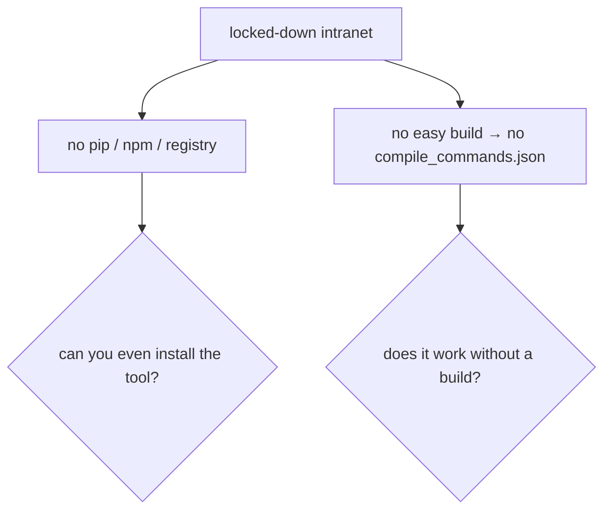

# Case Study — Intranet / air-gapped, no-build mode (wpa_supplicant)

The dimension that matters most on a **locked-down corporate intranet**: you can't `pip install`,
`npm install`, or easily run `bear -- make` to produce `compile_commands.json`. How does ccq work
**with no build at all**, and how do you deploy it where every package is copied in by hand?
Everything below is **real output** (run on **wpa_supplicant**, which has no compile DB here); §6
lists the bug this exercise found and fixed.

Complements [call-graph-redis-wpa](../call-graph-redis-wpa/README.md) (navigation/visualization) and
[safe-refactor](../safe-refactor/README.md) (editing).

---

## 1. The intranet pain



Two separate questions: **can you install it**, and **does it work without a build**. Most
"code-knowledge" tools struggle with one or both (Serena pulls ~890 Python packages and downloads
clangd; see [benchmark §4.5](../../benchmark.md)). ccq answers both.

## 2. Can you install it? — zero third-party dependencies

```console
$ go list -m all
github.com/swchen44/ccq
```
**One module — itself.** No third-party Go packages, so `go build` needs no network: copy the repo
in and build offline, or copy the single static binary. The only external piece is a `clangd`
binary (one file from an LLVM release; point ccq at it with `--clangd /path/to/clangd`).

## 3. Does it work without a build? — `ccq init` → no-build mode

No `compile_commands.json`, and you can't run the build. `ccq init` falls back to a flat
`compile_flags.txt` with auto-discovered include dirs:

```console
$ ccq init                      # wpa_supplicant, no build system reachable
compile_commands.json: …/wpa_supplicant (compile_flags(no-build))
clangd: /usr/bin/clangd
ready. try: ccq explore <symbol>

$ head -4 compile_flags.txt
-xc
-std=gnu11
-Ihs20/client
-Isrc/common
# … 22 auto-discovered -I dirs total
```

Now clangd resolves **cross-file** without a build:

```console
$ ccq def wpa_driver_wext_scan
// src/drivers/driver_wext.c:1091
int wpa_driver_wext_scan(void *priv, struct wpa_driver_scan_params *params)
{ …
```

## 4. The differentiator survives no-build — fn-pointer dispatch

The fn-pointer heuristic is **text-based**, so it works with or without a build. In no-build mode,
ccq still resolves the ops-struct dispatch that grep/cscope/cbm return 0 for:

```console
$ ccq callers wpa_driver_wext_scan
note: no-build mode (compile_flags.txt) — cross-file works but accuracy is lower than a real build (#ifdef over-included, no -D).
callers of wpa_driver_wext_scan:
  wpa_driver_wext_ops
  hostapd_driver_scan  (fnptr via wpa_driver_ops.scan2 @ src/ap/ap_drv_ops.c:609)
  wpa_drv_scan         (fnptr via wpa_driver_ops.scan2 @ wpa_supplicant/driver_i.h:98)
  wpa_priv_cmd_scan    (fnptr via wpa_driver_ops.scan2 @ wpa_supplicant/wpa_priv.c:134)
```

Graph (built the same way, offline): [wext-scan-nobuild-graph.html](wext-scan-nobuild-graph.html)
— `wpa_driver_wext_scan` focus + 3 dashed-gold fn-pointer edges.

## 5. The honest tradeoff — no-build vs a real build

ccq tells you it's degraded (the `note:` above). What you lose without a real `compile_commands.json`:

| | no-build (`compile_flags.txt`) | real build (`compile_commands.json`) |
|--|--------------------------------|--------------------------------------|
| cross-file navigation | ✅ works | ✅ works |
| fn-pointer dispatch | ✅ (text-based) | ✅ |
| `#ifdef` | ⚠️ over-included (no `-D` config) | ✅ correct per build config |
| macros needing `-D` | ⚠️ may be wrong | ✅ |

Accuracy ladder: `compile_commands.json` > `compile_flags.txt` > same-file. No-build trades some
accuracy for working **at all** where you can't build — the right call on an air-gapped box.

## 6. Findings — what the real run surfaced ✅

**🐛 Bug found & fixed — the no-build warning was hidden in the default (daemon) path.**
The `note: no-build mode …` only printed with `--no-daemon`. Running ccq normally (warm daemon) in a
`compile_flags.txt` repo printed **nothing**, so an intranet user wouldn't know accuracy was reduced.
**Fixed**: the warning now prints for every query, daemon or inline (the §4 output is post-fix).

## 7. Deploy on an air-gapped box

```bash
# build once where you have Go (no network needed — zero third-party deps):
go build -o ccq ./cmd/ccq

# copy onto the target: the single `ccq` binary, SKILL.md, and one `clangd` binary
#   (or use a release built with ./build-release.sh --bundle-clangd, which packs clangd in)
ccq --clangd /opt/llvm/bin/clangd init        # if clangd isn't on PATH
ccq callers <symbol>                          # no build required
```

Footprint comparison and the full intranet table: [benchmark §4.5](../../benchmark.md). Design:
[../../design.md](../../design.md).
