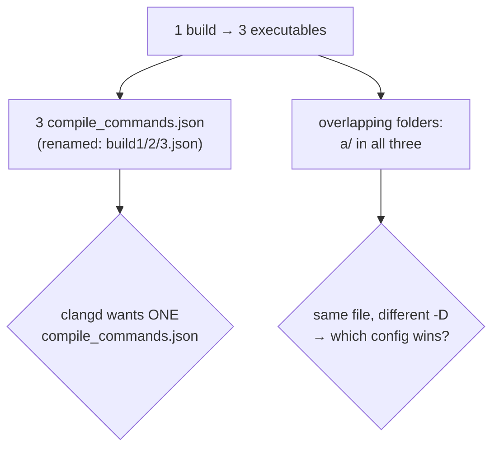

# Case Study — Multi-target build, many compile databases (`--compdb`)

A real intranet build shape: **8 source folders**, and one build produces **3 executables**, so it
emits **3 `compile_commands.json`** — renamed and scattered to keep them. The three targets use
**overlapping** folders:

| Executable | Folders | Build macro |
|-----------|---------|-------------|
| exe1 | a, b, c | `-DBUILD1` |
| exe2 | a, d, e, f | `-DBUILD2` |
| exe3 | a, b, g, h | `-DBUILD3` |

`a/` is shared by all three; `b/` by exe1 & exe3. clangd takes **exactly one** `compile_commands.json`
per directory — so this shape needs `--compdb`. Everything below is **real output**.

---

## 1. The problem



## 2. Cover everything — merge the 3 (`--compdb a,b,c`)

```console
$ ccq search core_common --compdb build1.json,build2.json,build3.json -p .
$ ccq search fn_d        --compdb build1.json,build2.json,build3.json -p .
```
Symbols from **all 8 folders** resolve through one merged database (verified):

| symbol (folder) | found via merged `--compdb` |
|-----------------|------------------------------|
| `core_common` (a) | ✅ |
| `fn_b` (b) | ✅ |
| `fn_d` (d, only in exe2) | ✅ |
| `fn_g` (g, only in exe3) | ✅ |

ccq stages the 3 arrays into one `compile_commands.json` in a cache dir and points clangd there; the
source root stays `-p .` (OpenAll/fnptr scan the 8 folders).

## 3. The overlap gotcha — first `--compdb` wins ⚠️

`a/core.c` is compiled three ways:
```c
#ifdef BUILD1
int feature_for_exe1(void){ return 1; }
#endif
#ifdef BUILD2
int feature_for_exe2(void){ return 2; }
#endif
#ifdef BUILD3
int feature_for_exe3(void){ return 3; }
#endif
```
For a file with **multiple entries**, clangd silently uses the **first** one in the merged database.
ccq concatenates in `--compdb` order, so the **first `--compdb` listed wins** (real output):

```console
$ # build1.json first
$ ccq def feature_for_exe1 --compdb build1.json,build2.json,build3.json -p .   # ✅ found (BUILD1 active)
$ ccq def feature_for_exe2 --compdb build1.json,build2.json,build3.json -p .   # ❌ symbol not found
$ ccq def feature_for_exe3 --compdb build1.json,build2.json,build3.json -p .   # ❌ symbol not found
```

| listed first | `a/core.c` view |
|--------------|-----------------|
| `build1.json,…` | `feature_for_exe1` ✅ · exe2/exe3 inactive |
| `build2.json,…` | `feature_for_exe2` ✅ · exe1/exe3 inactive |

**So: order `--compdb` so the config you care about for overlapping files comes first.** (`Stage`
preserves order, pinned by `TestStageMerge`. It does **not** dedup — that's deliberate; "which entry
to keep" is a config choice, left to your ordering. Pre-`jq` if you want finer control.)

## 4. Exact per-config view — one `--compdb`, no re-index

For exe2's exact `#ifdef`, query that build alone:
```console
$ ccq def feature_for_exe2 --compdb build2.json -p .   # ✅ found (BUILD2)
$ ccq def feature_for_exe1 --compdb build2.json -p .   # ❌ not in BUILD2
```
And each distinct `--compdb` gets its **own warm clangd** (daemon keyed by `(root, compdb set)`), so
you can keep exe1/exe2/exe3 views warm **simultaneously** and switch with **no re-index**:
```console
$ ccq callers foo --compdb build1.json -p .   # spawns daemon A
$ ccq callers foo --compdb build2.json -p .   # spawns daemon B (separate)
$ ps | grep 'ccq __daemon'                     # → 2 processes, one per config
```
(Symlinking a single `compile_commands.json` and swapping it would force clangd to re-index on every
switch — `--compdb` avoids that.)

## 5. Tradeoff — a clangd per config isn't free

Each warm config = its own in-memory index (**RAM ×N**, not shared), its own cold-index cost, and
possible `.cache/clangd` contention; edits must sync to each. Use a handful of configs, not dozens.
See [benchmark §4.5](../../benchmark.md) and [design §6](../../design.md).

## 6. Decision guide

| You want | Do |
|----------|----|
| One view across all 8 folders | `--compdb build1.json,build2.json,build3.json` (order matters for overlaps) |
| exe2 exactly, switch fast | `--compdb build2.json` (its own warm daemon) |
| No build info at all | `ccq init` → no-build mode ([intranet-no-build](../intranet-no-build/README.md)) |

## 7. Findings

No ccq bug this round — the behavior is clangd's (first entry wins), now **documented and pinned**
by `TestStageMerge` (order preserved) and `TestCompdbNamedFile` (renamed DB resolves). The honest
limitation (first-wins for overlapping files) is in the [README Limitations](../../../README.md#limitations).
