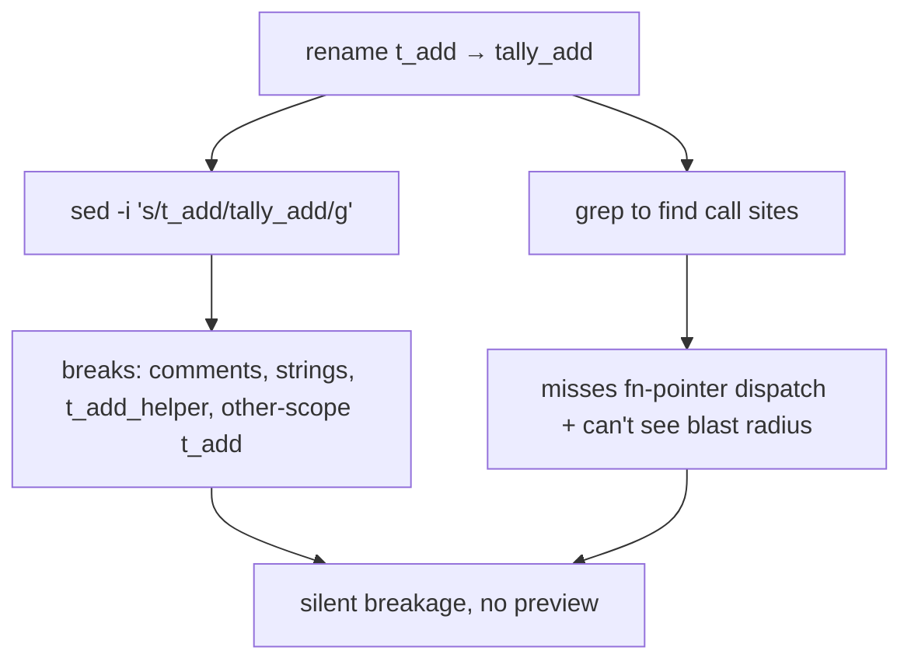
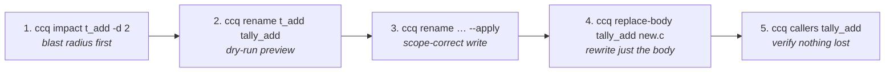

# Case Study — Safe refactoring with ccq (impact → rename → replace-body)

> **Status: skeleton.** Structure + exact commands are in place; the `TODO(capture)` blocks are
> filled by running the commands on a real repo. This case study shows ccq's **editing** dimension
> (Serena-parity) — the complement to [call-graph-redis-wpa](../call-graph-redis-wpa/README.md),
> which showed navigation + fn-pointer + visualization.

Target repo for the worked run: **ctest8** (tiny, fast) and/or **redis** (realistic blast radius).
Scenario: safely **rename** a widely-called function and **rewrite its body**, *seeing the blast
radius first* and never touching a comment, string, or a same-named symbol in another scope.

---

## 1. Why this is hard without ccq

An agent asked to "rename `t_add` to `tally_add` everywhere and tighten its body" with text tools:



Text rename is scope-blind and string-blind; and you change code **before** knowing what depends on it.

## 2. The ccq workflow — look before you leap



### Step 1 — blast radius before touching anything
```bash
ccq impact t_add -d 2 -p repos/ctest8
```
```text
TODO(capture): transitive callers to depth 2 (incl. fn-pointer dispatchers)
```

### Step 2 — preview the rename (dry-run, default)
```bash
ccq rename t_add tally_add -p repos/ctest8
```
```text
TODO(capture): edit list across files — clangd-accurate, skips comments/strings and same-named
symbols in other scopes (the thing sed gets wrong)
```

### Step 3 — apply it
```bash
ccq rename t_add tally_add --apply -p repos/ctest8
```
```text
TODO(capture): "applied N edit(s)."
```

### Step 4 — rewrite just the body (symbol-level, not line numbers)
```bash
printf 'int tally_add(int a, int b){ return a + b; /* hardened */ }' > /tmp/new.c
ccq replace-body tally_add /tmp/new.c -p repos/ctest8            # dry-run
ccq replace-body tally_add /tmp/new.c --apply -p repos/ctest8    # write
```
```text
TODO(capture): dry-run edit + applied; show the .c body changed, sub/other symbols untouched
```

### Step 5 — verify nothing was lost
```bash
ccq callers tally_add -p repos/ctest8
```
```text
TODO(capture): same caller set as t_add had in step 1 (rename preserved the graph)
```

## 3. The picture — before/after the rename

```bash
ccq export --format html --focus tally_add -d 1 -p repos/ctest8 --out after.html
```
`TODO(capture): screenshot / link the interactive graph showing the renamed node + preserved edges`

## 4. What this proves

- **Scope- and string-correct rename** (clangd), not text substitution.
- **Blast radius first** (`impact`) — decide *before* editing.
- **Symbol-level body rewrite** (`replace-body`) — no line-number bookkeeping.
- Same zero-dependency single binary; works in no-build mode too (see the intranet case study — TODO).

## 5. Bugs this case study found

`TODO`: writing a case study is a test — record anything the real run surfaces here (the first case
study found 5). Leave empty only if genuinely none.

## 6. Reproduce

```bash
# tiny + fast
ccq impact t_add -d 2 -p repos/ctest8
ccq rename t_add tally_add --apply -p repos/ctest8
ccq replace-body tally_add /tmp/new.c --apply -p repos/ctest8

# realistic blast radius (a widely-called redis function)
ccq impact lookupCommand -d 2 -p repos/redis
ccq rename lookupCommand lookupCmd -p repos/redis   # dry-run only — don't --apply a real repo
```

Design: [../../design.md](../../design.md) · Benchmark: [../../benchmark.md](../../benchmark.md).
