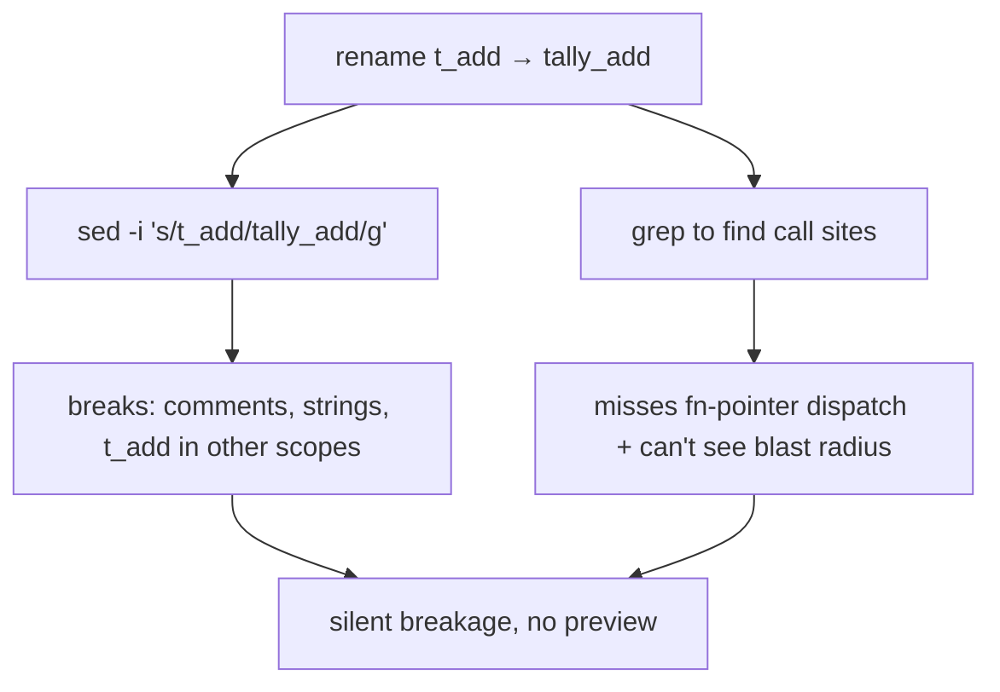
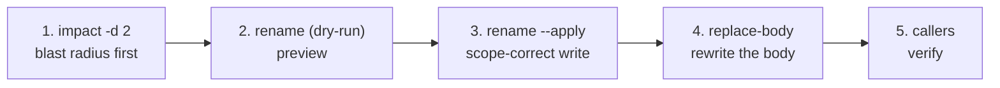

# Case Study — Safe refactoring with ccq (impact → rename → replace-body)

Shows ccq's **editing** dimension (Serena-parity) — the complement to
[call-graph-redis-wpa](../call-graph-redis-wpa/README.md), which showed navigation + fn-pointer +
visualization. Everything below is **real output** (run on **ctest8**); §5 lists the bug this
exercise found and fixed.

Scenario: safely **rename** `t_add` → `tally_add` and **rewrite its body**, *seeing the blast radius
first* and never breaking a comment or a same-named symbol in another scope.

---

## 1. Why this is hard without ccq



Text rename is scope-blind and string-blind, and you change code **before** knowing what depends on it.

## 2. The ccq workflow — look before you leap



### Step 1 — blast radius before touching anything
```console
$ ccq impact t_add -d 2
impact radius of t_add (depth 2): 8 symbols
  VT (hop 1)            bar_wrapper (hop 1)   foo_wrapper (hop 1)
  get_op (hop 1)        helper (hop 1)        knr_caller (hop 1)
  via_typedef (hop 1)   f5a_use (hop 2)
```
You see the full reach (incl. transitive `f5a_use` at hop 2) *before* editing. `ccq callers t_add`
also adds the fn-pointer dispatcher `f6_dispatch (fnptr via vtable.op_a)` that `impact` (clangd call
hierarchy) doesn't.

### Step 2 — preview the rename (dry-run, default)
```console
$ ccq rename t_add tally_add
rename t_add -> tally_add : 7 edits across 6 files
  targets.h (1)   targets.c (1)   f1_declarators.c (2)
  f2_typedef.c (1)   f5a_static.c (1)   f6_ops.c (1)
(dry-run; pass --apply to write changes)
```
clangd-accurate: it edits the declaration in `targets.h`, the definition in `targets.c`, and every
resolved call site — **across files**, and (see §5) it leaves comments and other-scope tokens alone.

### Step 3 — apply it
```console
$ ccq rename t_add tally_add --apply
... applied 7 edits.
```

### Step 4 — rewrite just the body (symbol-level, not line numbers)
```console
$ printf 'int tally_add(int a,int b){ return a + b; /* hardened */ }' > /tmp/new.c
$ ccq replace-body tally_add /tmp/new.c            # dry-run
replace-body tally_add: 1 edit(s) across 1 file(s)
  targets.c
(dry-run; pass --apply to write changes)
$ ccq replace-body tally_add /tmp/new.c --apply
... applied 1 edit(s).
```
`replace-body` targets the **definition body** in `targets.c` by symbol — `t_sub`/`t_mul` next to it
are untouched. No line-number bookkeeping.

### Step 5 — verify on the same warm daemon
```console
$ ccq callers tally_add
callers of tally_add:
  VT   get_op   helper   knr_caller   via_typedef
  f6_dispatch  (fnptr via vtable.op_a @ f6_ops.c:4)
```
The rename + body-rewrite are reflected immediately (this used to be broken — see §5, bug found).

## 3. The picture — the renamed neighborhood

`ccq export --format html --focus tally_add -d 1 --out after.html` →
[after-rename-graph.html](after-rename-graph.html) (interactive; `tally_add` focus, its callers, and
the fn-pointer edge from `f6_dispatch`).

## 4. What this proves

- **Blast radius first** (`impact`) — decide *before* editing.
- **Scope- and comment-correct rename** (clangd), not text substitution.
- **Symbol-level body rewrite** (`replace-body`) — no line numbers; siblings untouched.
- Same zero-dependency single binary.

## 5. Findings — what the real run surfaced ✅

**🐛 Bug found & fixed — warm daemon served stale results after `--apply`.**
On the first run, right after `ccq rename t_add tally_add --apply`, the *same* daemon answered
`ccq callers tally_add` with `(none)` and `ccq replace-body tally_add` with "symbol not found".
Root cause: the apply wrote files on disk but didn't tell clangd, so its in-memory index was
pre-rename. **Fixed**: after an apply, ccq now re-syncs clangd (`textDocument/didChange`) for the
changed files and drops the fn-pointer cache. The Step-5 output above is the post-fix result.

**⚠️ Honest limitation — clangd rename doesn't rewrite macro-body occurrences.**
`callers t_add` had 8 entries before; `callers tally_add` has 6. The missing two —
`foo_wrapper`/`bar_wrapper` — are generated by an X-macro whose body still reads
`... { return t_add(1,1); }`. clangd renames *resolved symbol references*, not tokens inside an
unexpanded macro definition, so that call site keeps the old name. (Conversely, clangd correctly
**did not** touch the `t_add` mentions that were only in comments.) Mitigation: a follow-up
`ccq search t_add` surfaces the leftover macro occurrence to fix by hand.

> The case study is, itself, a test — one real bug fixed, one real limitation documented.

## 6. Reproduce

```bash
# work on a copy — rename --apply rewrites files
cp -r repos/ctest8 /tmp/refactor && cd /tmp/refactor   # regenerate compile_commands.json for the new path
ccq impact t_add -d 2
ccq rename t_add tally_add --apply
printf 'int tally_add(int a,int b){ return a + b; }' > /tmp/new.c
ccq replace-body tally_add /tmp/new.c --apply
ccq callers tally_add
ccq search t_add                 # catch macro-body leftovers
ccq export --format html --focus tally_add -d 1 --out after.html
```

Design: [../../design.md](../../design.md) · Benchmark: [../../benchmark.md](../../benchmark.md).
