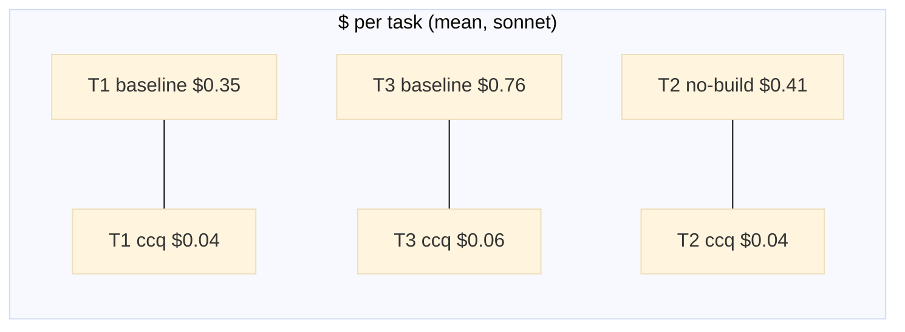

# Case Study — Does ccq actually pay off? (real Claude Code A/B: tokens, cost, completion)

The skeptical question every decision-maker asks: *"There are a hundred code tools on GitHub —
why build and **maintain** another one? What do I get?"* This case study answers it with **real,
reproducible numbers**, not marketing.

We run the **same** AI coding agent (Claude Code, headless, `--model sonnet`) on the **same tasks**,
changing exactly **one** thing: whether `ccq` is available. We read the **actual** token usage and
USD cost straight from each run's `--output-format json` (no estimates), score the answer against
ground truth, and repeat **N=3** per cell. Raw per-run JSON is kept under [`raw/`](raw/) for audit.

> **Half of real-world C lives with no build system** (no `compile_commands.json`). So two of the
> five tasks run on **wpa_supplicant in no-build mode** — the scenario that matters most for intranet
> firmware/driver code.

## TL;DR

| | with ccq vs without |
|---|---|
| **Token cost** | **1.8×–7.9× fewer** tokens per task (more on call-graph questions) |
| **Dollar cost** | **2.1×–12.4× cheaper** per task; **6.7× cheaper** over the whole suite ($5.47 → $0.81) |
| **Speed** | ~**6× faster** wall-clock (e.g. 162s → 13s on blast-radius) |
| **Completion** | one no-build task the agent **could not solve at all without ccq** (0% vs 100%) |
| **Turns** | grep+read loops for **9–33 tool turns**; ccq answers in **2–4** |

These hold even though Claude Sonnet is a strong model that *can* grep-and-read its way to most
answers — it just burns far more tokens, time, and turns doing it, and **fails outright on
function-pointer dispatch in no-build code**.

## Results (mean of N=3; full data in [results.md](results.md), raw in [raw/](raw/))

| # | Task | repo / mode | cond | tokens | $ cost | turns | wall | recall |
|---|------|-------------|------|-------:|-------:|------:|-----:|-------:|
| T1 | list all callers of `lookupCommand` | redis / build | baseline | 293,335 | $0.346 | 25 | 73s | 100% |
| | | | **ccq** | **53,491** | **$0.039** | **2** | **11s** | **100%** |
| T2 | who triggers `wpa_driver_wext_scan` | **wpa / no-build** | baseline | 422,431 | $0.408 | 33 | 149s | 100% |
| | | | **ccq** | **53,684** | **$0.040** | **2** | **14s** | **100%** |
| T3 | blast radius of `lookupCommand` (depth 2) | redis / build | baseline | 406,559 | $0.758 | 17 | 162s | 100% |
| | | | **ccq** | **54,047** | **$0.061** | **2** | **13s** | **100%** |
| T4 | explain `processCommand` (callers+callees) | redis / build | baseline | 178,829 | $0.172 | 9 | 61s | 100% |
| | | | **ccq** | **56,107** | **$0.063** | **4** | **26s** | **100%** |
| T5 | explain `hostapd_driver_scan` (callers+callees) | **wpa / no-build** | baseline | 111,283 | $0.139 | 4 | 35s | **0%** |
| | | | **ccq** | **63,438** | **$0.068** | **3** | **16s** | **100%** |

**Savings (baseline ÷ ccq):** T1 5.5× tok / 8.9× $ · T2 7.9× / 10.3× · T3 7.5× / **12.4×** ·
T4 3.2× / 2.7× · T5 1.8× / 2.1×. Cost ratios beat token ratios because ccq's answers are short and
its few turns ride a warm cache.



## The finding that isn't about cost: completion (T5, no-build)

T1–T4 end in the same answer — ccq just gets there ~5× cheaper. **T5 is different.** Asked to explain
`hostapd_driver_scan` in **no-build** wpa_supplicant, the baseline agent had to name its callees. It
found the indirect call site and stopped there — across **all 3 runs** it answered (translated):

> "the only callee is the function pointer `hapd->driver->scan2`… the real driver implementation
> (e.g. `nl80211_scan2`) is bound at runtime"

— i.e. it **could not resolve the dispatch** (and even guessed the wrong handler). Ground truth is
`wpa_driver_wext_scan`, registered as the `.scan2` field. ccq's fn-pointer synthesizer resolves it
**every time (100%)**. This is the structural blind spot of grep/read: *runtime function-pointer
dispatch is invisible to text search*, and it's exactly where no-build C (drivers, ops tables,
callbacks) lives. No amount of extra tokens fixes a 0%.

## ROI — what a decision-maker actually wants

All assumptions are explicit and adjustable; the **ratios** above are the robust part, the absolute
dollars scale with your model and volume.

| Input (illustrative) | Value |
|---|---|
| Avg saving per code-understanding query (baseline − ccq, sonnet) | ~**$0.31** |
| Engineers using AI agents on C/C++ | 50 |
| Such queries / engineer / workday | 10 |
| Workdays / year | 230 |
| **Queries / year** | **115,000** |
| **Annual token-cost saved (sonnet)** | **≈ $35,000** |
| Same on a frontier model (~5× price) | **≈ $175,000** |
| Engineer time saved (~80s/query × 115k) | **≈ 2,500 hours/year** |

**Maintenance cost on the other side of the ledger:** ccq is a **single zero-dependency Go binary +
one skill file**. Even at **one-tenth** of every assumption above (5 engineers, 1 query/day),
it still saves **~$3,500/yr + 250 hrs/yr** — far more than it costs to keep a static binary building
in CI. And the token/time savings are the *measurable* part; the unmeasured part is the no-build
fn-pointer tasks an agent **silently gets wrong** without it.

## Honest caveats (so this isn't marketing)

- **Fair A/B:** identical model (`sonnet`) and identical task prompt for both arms; the only
  difference is `ccq` on `$PATH`. The baseline genuinely **cannot** call ccq (it's PATH-excluded,
  `command not found`) — not "asked nicely not to."
- **Real numbers, not a proxy:** tokens and `total_cost_usd` come from each run's Claude Code
  session JSON; every run is saved in [`raw/`](raw/).
- **Non-determinism is shown, not hidden:** N=3 per cell; baseline is **high-variance** (T3 ranged
  $0.20–$1.15, T2 $0.20–$0.78) while ccq is tight ($0.02–$0.10). Means are reported above.
- **Prompts are neutral:** T2/T5 ask the natural developer question ("who triggers / what does it
  call"); they do **not** reveal the `.scan2` mechanism, so neither arm is coached.
- **ccq was warm** (`ccq wait-index` first), which is its intended use; first-ever cold index adds a
  one-time ~10–30s (see the [index-control](../index-control/README.md) case study).
- **Scope:** 5 tasks on 2 repos; this measures call-graph / understanding queries, where ccq is
  built to win — not, say, prose generation.

## Reproduce

```bash
# needs: claude CLI, ccq on ~/git/ccq/ccq, redis + wpa_supplicant under cbm-vs-codegraph-bench/repos
cd docs/case-studies/token-cost
python3 run_ab.py --tasks T1 --runs 1     # calibrate one task cheaply
python3 run_ab.py --runs 3                # full suite, N=3  (~$6 of API, ~30 min)
python3 run_ab.py --report                # rebuild the tables from raw/
```

Tasks + ground truth live in [`tasks.json`](tasks.json); the harness is [`run_ab.py`](run_ab.py).
Related: [call-graph](../call-graph-redis-wpa/README.md) (what ccq returns) ·
[intranet-no-build](../intranet-no-build/README.md) (the no-build mode) ·
[benchmark.md](../../benchmark.md) (the tool-vs-tool recall study).
