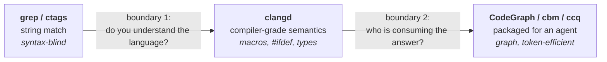
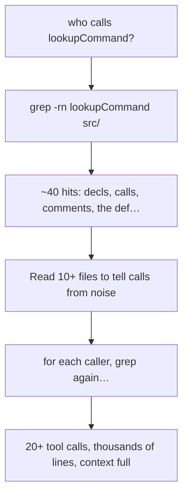
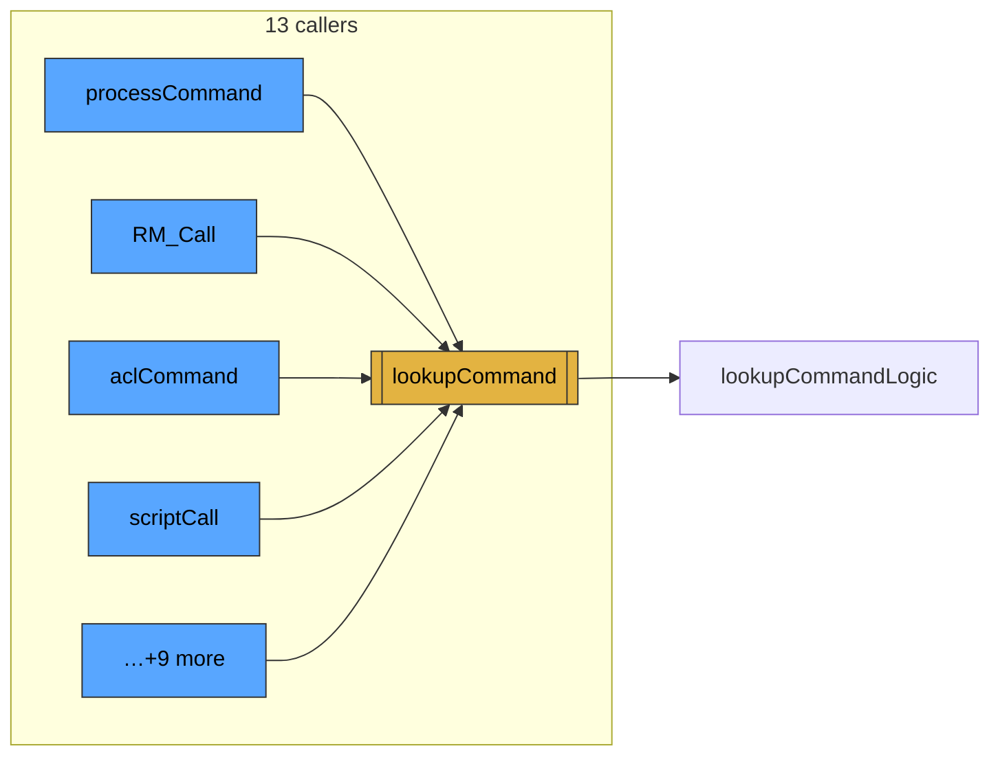
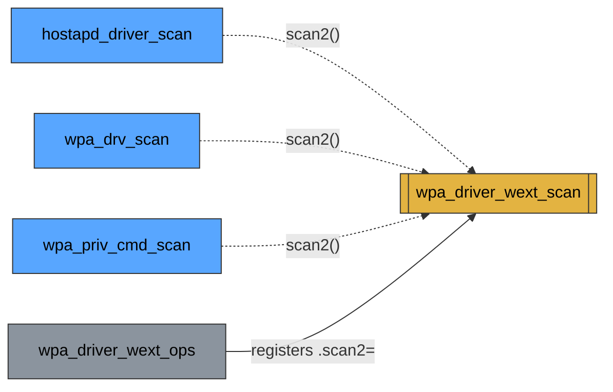

# Case Study — Why ccq, shown not told (redis & wpa_supplicant)

This walks from **theory → naive approach → layered approach → real ccq output → pictures**,
on two real codebases (**redis**, **wpa_supplicant**). The goal is simple: to convince you the
way the author was convinced. Everything below is **real ccq output**, and §7 lists the **bugs
this very exercise found and fixed**.

> Two interactive, offline, zero-dependency knowledge graphs are generated from this data:
> [`redis-callgraph.html`](case-study/redis-callgraph.html) and
> [`wpa-fnptr-graph.html`](case-study/wpa-fnptr-graph.html) (open in any browser — no server, no CDN).

---

## 1. Theory — three layers, two boundaries

Code-intelligence tools sit in three layers. The jump between them is the whole story.



| Layer | What it does | Answers |
|-------|--------------|---------|
| **grep / ctags** | match characters (can't tell a function from a comment) | "where do the letters `foo` appear?" |
| **clangd** | understand the language (compiler frontend) | "which symbol *is* this `foo`, and who calls it?" |
| **agent tools** | package knowledge for an LLM | "give me `foo`'s whole picture in the fewest tokens" |

**Boundary 1 (grep→clangd) is about *semantics*.** **Boundary 2 (clangd→agent tools) is about the
*consumer*.** These decades-old engines (cscope is from the 1970s) got repackaged not because search
got better, but because the *reader changed*:

- A **human** with grep does *interactive convergence* — unlimited cheap round-trips and a persistent
  mental model. The tool gives clues; you converge in your head.
- An **LLM** has **neither**: every `grep`/`Read` burns tokens and context, and it has **no memory
  across turns**. Tracing 5 call levels is 5 clicks for you and 20+ tool calls + thousands of lines
  for the model — context overflows.

So for an agent the bottleneck is not "can it search" but **"can it get a converged, structured
answer in the fewest tokens."** That is what the third layer sells.

> **ccq's bet:** don't rebuild the engine. Take the most accurate one (clangd), add the one thing it
> lacks (fn-pointer dispatch), and repackage it for agents (token-efficient CLI + skill).

---

## 2. The same task, naive vs layered

Task: *"Who calls `lookupCommand` in redis, and what does it call — what's the blast radius?"*

**Naive (grep + Read), what an agent actually does:**

grep returns the declaration, the definition, comments, and unrelated substrings all mixed together;
the agent must read files to classify each — and repeat per hop.

**Layered (ccq), one call:**
```bash
ccq explore lookupCommand
```
returns source + callers + callees + blast-radius in a single, already-converged answer (next section).

---

## 3. Worked example — redis (`lookupCommand`)

redis has a real `compile_commands.json`, so ccq runs clangd at full accuracy.

### `ccq explore lookupCommand` — one shot
```
=== explore: lookupCommand ===
--- source (src/server.c:3611) ---
struct redisCommand *lookupCommand(robj **argv, int argc) {
    return lookupCommandLogic(server.commands,argv,argc,0);
}
--- callers (13) ---
  RM_ACLCheckCommandPermissions   RM_Call   RM_GetCommandKeysWithFlags
  _serverAssertPrintClientInfo    aclCommand   asmFeedMigrationClient
  getKeysSubcommandImpl   loadSingleAppendOnlyFile   logCurrentClient
  luaRedisAclCheckCmdPermissionsCommand   preprocessCommand
  processCommand   scriptCall
--- callees (1) ---
  lookupCommandLogic
```
One call, ~500 bytes of JSON with `--json`. The 13 callers match the ground truth (`cscope`/manual);
the source is the **definition body** (`server.c`), not the header prototype.

### As a graph (the structured output)


### `ccq export` — structured graph for your own queries
```json
{"nodes":[{"name":"lookupCommand","kind":"function","file":"src/server.c","line":3611}, …],
 "edges":[{"src":"processCommand","dst":"lookupCommand","kind":"calls"}, …]}
```
`ccq export --format sql | sqlite3 g.db` then query with plain SQL — a zero-dependency substitute for
CodeGraph's Cypher. **An interactive HTML view of the real neighborhood (33 nodes) is in
[`case-study/redis-callgraph.html`](case-study/redis-callgraph.html).**

---

## 4. The differentiator — wpa_supplicant fn-pointer dispatch

wpa_supplicant has **no `compile_commands.json`** here, so ccq runs **no-build mode**
(`ccq init` writes a `compile_flags.txt`). The fn-pointer heuristic is text-based, so it works anyway.

The driver layer dispatches scans through an **ops struct**: `drv->scan2(...)` where `scan2` was
registered to a concrete handler like `wpa_driver_wext_scan`. grep, cscope and cbm all return **0**
callers for this — it's a runtime indirect call. ccq synthesizes it:

```
$ ccq callers wpa_driver_wext_scan        # (no-build mode, no build required)
callers of wpa_driver_wext_scan:
  wpa_driver_wext_ops
  hostapd_driver_scan  (fnptr via wpa_driver_ops.scan2 @ src/ap/ap_drv_ops.c:609)
  wpa_drv_scan         (fnptr via wpa_driver_ops.scan2 @ wpa_supplicant/driver_i.h:98)
  wpa_priv_cmd_scan    (fnptr via wpa_driver_ops.scan2 @ wpa_supplicant/wpa_priv.c:134)
```



The dotted edges are **synthesized** from `(struct, field) = (wpa_driver_ops, scan2)` registrations +
dispatch sites — exactly the gap CodeGraph beats clangd on, recovered here **without a build**, with
the registration site cited. Interactive view: [`case-study/wpa-fnptr-graph.html`](case-study/wpa-fnptr-graph.html).
For blind spots the text scan can't infer, a [`ccq.fnptr.json`](../README.md#differentiators) override
table adds ground-truth edges.

---

## 5. From result to picture

`ccq export --json` is the bridge from "answer" to "knowledge graph". The included generator turns it
into a **self-contained, offline, zero-dependency** interactive HTML graph (vanilla-JS force layout —
no D3, no CDN, on-brand with ccq's zero-dependency ethos):

```bash
ccq export --format json -p <repo> --out graph.json
python3 docs/case-study/make_graph.py graph.json graph.html "My call graph"
open graph.html       # drag nodes, hover to isolate a neighborhood; fn-pointer edges dashed gold
```

This is the same idea as the CodeGraph HTML knowledge graph people share — but driven by a
**compiler-grade** engine and a **single zero-dependency binary**.

---

## 6. The FAQ, distilled

- **"Isn't this just search? Agents can grep."** Search is solved; *converging* and *fitting in a token
  budget* is not. Layer 3 pre-computes the convergence a human would do by hand.
- **"Old tools exist — why CodeGraph/ccq?"** The engine isn't new; the **consumer** is. Same call
  graph, repackaged for a reader with no memory and expensive tokens.
- **"Then why not old engine + LLM directly?"** That *is* ccq: clangd (layer 2, most accurate) + the
  one missing piece (fn-pointer synthesis) + a token-efficient skin (layer 3). No new engine, just the
  best of each layer.

---

## 7. Bugs this case study found (and fixed) ✅

Writing this on real repos surfaced four issues — all now fixed/recorded:

| # | Symptom (on real repos) | Root cause | Status |
|---|--------------------------|-----------|--------|
| 1 | `explore` showed **0 callees** for an fn-pointer dispatcher | `explore` still used clangd's unreliable `outgoingCalls` | **fixed** — shares the `callees` body-scan + fnptr logic |
| 2 | `explore lookupCommand` showed the **header prototype** and **0 callees** | clangd go-to-definition jumps def→declaration; we showed/scanned the decl | **fixed** — `def`/`explore`/`callees` use `symbolRange` (source-file definition) |
| 3 | `explore` was **slow** on redis (re-scanned all 472 files each query) | `fnptr.build(root)` had no cache | **fixed** — per-root cache; warm `explore` ≈ **0.85s** |
| 4 | `ccq export` (whole repo) **times out** on a 472-file repo | export does call-hierarchy per function across the whole tree | **known limitation** — use a focused neighborhood (as here); roadmap: scope/parallelize export |

> The case study is, itself, a test. That's the point — these are real outputs, including the warts.

---

## 8. Reproduce

```bash
# redis (full accuracy)
ccq explore lookupCommand -p repos/redis
ccq export --format json -p repos/redis --out g.json
python3 docs/case-study/make_graph.py g.json redis.html "redis"

# wpa_supplicant (no-build mode; fn-pointer dispatch)
ccq init -p repos/wpa_supplicant
ccq callers wpa_driver_wext_scan -p repos/wpa_supplicant
```
Benchmark numbers and methodology: [benchmark.md](benchmark.md). Design: [design.md](design.md).
