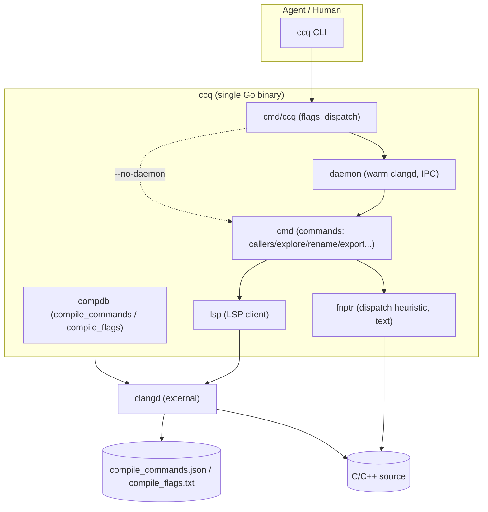
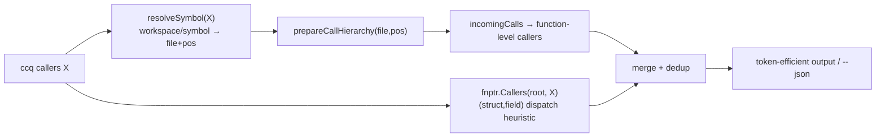
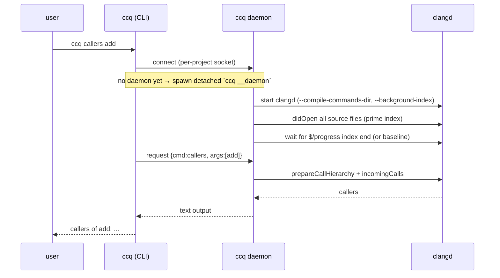
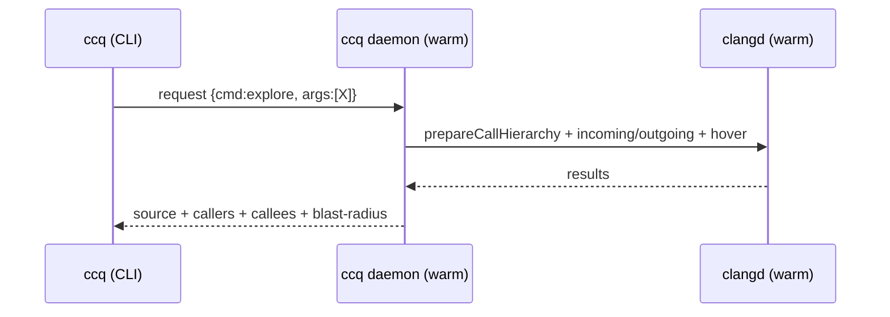
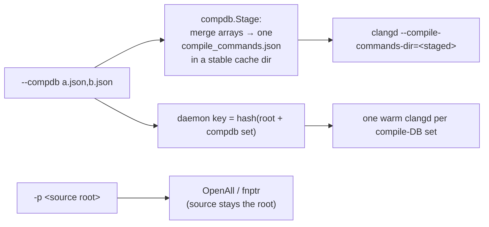

# ccq — Design

This document describes ccq's architecture, modules, data flow, sequences, and protocols.

## 1. Architecture overview

ccq is a thin, fast layer over **clangd**: it speaks LSP to clangd for compiler-accurate
answers, adds a text-based **function-pointer heuristic** that clangd won't do, keeps clangd
**warm** in a daemon, and renders **token-efficient** output for AI agents.



## 2. Module responsibilities

| Module | File(s) | Responsibility |
|--------|---------|----------------|
| CLI / dispatch | `cmd/ccq/main.go` | parse flags, resolve clangd, route to daemon or inline, subcommands |
| daemon | `internal/daemon/*.go` | keep one clangd warm per project; IPC (Unix socket / TCP); idle shutdown; spawn-on-demand |
| commands | `internal/cmd/run.go`, `edit.go`, `export.go` | implement each subcommand on an `lsp.Client`; output to an `io.Writer` |
| LSP client | `internal/lsp/client.go`, `util.go` | drive clangd over JSON-RPC/stdio: symbols, definition, references, call hierarchy, hover, rename |
| fnptr heuristic | `internal/fnptr/fnptr.go`, `table.go` | resolve `obj->fn()` dispatch to handlers (text only); merge a user `ccq.fnptr.json` override (registrations + links) |
| compile DB | `internal/compdb/compdb.go` | locate/generate `compile_commands.json`, or no-build `compile_flags.txt` |
| git diff | `internal/gitdiff/gitdiff.go` | files changed since last index, to prioritise re-indexing on a warm daemon restart |

## 3. Data flow — answering "who calls X"



## 4. Sequence — first (cold) query spawns the daemon



Subsequent (warm) queries skip the spawn/index and return in well under a second:



## 5. Sequence — function-pointer heuristic (no clangd)

```mermaid
sequenceDiagram
    participant F as fnptr.Callers(root, handler)
    participant S as source files (text)
    F->>S: Pass A: scan fn-pointer typedefs + function defs
    F->>S: Pass B: struct layouts (mark fn-pointer fields)
    F->>S: Pass C: registrations (.field=fn / positional {"n",fn})
    F->>S: Pass D: field←field propagation (a->f = b->g), 3x to converge
    F->>S: Pass E: dispatch sites recv->field() → enclosing function
    Note over F: keyed by (struct,field); FANOUT_CAP; real-function gate
    F-->>F: dispatcher→handler edges (heuristic)
```

## 6. Protocols

### LSP methods used (ccq → clangd, JSON-RPC over stdio)
| Need | LSP method |
|------|-----------|
| find symbols | `workspace/symbol` |
| definition | `textDocument/definition` |
| references | `textDocument/references` |
| who calls | `textDocument/prepareCallHierarchy` → `callHierarchy/incomingCalls` |
| what it calls | `callHierarchy/outgoingCalls` (clangd-limited; export uses incoming instead) |
| file outline | `textDocument/documentSymbol` |
| macro / signature | `textDocument/hover` |
| rename | `textDocument/rename` |
| index readiness | `$/progress` (window/workDoneProgress) |

### Compile database & accuracy ladder
| Config | How clangd behaves | Accuracy |
|--------|-------------------|----------|
| `compile_commands.json` | full background index, real flags + `-D` | highest (correct `#ifdef`, includes) |
| `compile_flags.txt` (no-build) | flat flags, no background index; ccq primes via OpenAll | cross-file works; `#ifdef` over-included, no `-D` |
| none | `clang foo.c` guess | same-file only |

### `--compdb` — multiple / renamed compile databases (multi-target builds)

clangd takes **exactly one** database named `compile_commands.json` in a directory (it doesn't
merge several or accept arbitrary names). Builds that emit several executables produce several
databases, often renamed and scattered. `--compdb` bridges that:

```
ccq callers foo --compdb build1.json,build2.json    # any names; comma-separated
```



- **Decoupling**: the compile DB (`--compdb`) and the source root (`-p`) are separate — source
  scanning (OpenAll, fnptr) stays on `-p`, while clangd's flags come from the staged DB.
- **Merge semantics & priority**: arrays are concatenated **in `--compdb` order**. A file built
  several ways keeps all its entries; for a duplicated `file`, clangd silently uses the **first**
  matching entry (verified empirically — same `dup.c` with `-DCONFIG_A` vs `-DCONFIG_B`: whichever
  `--compdb` is listed first wins; the other branch is inactive). So **order `--compdb` so the
  config you want for overlapping files comes first**, or pass a single `--compdb` for an exact
  per-config view. `compdb.Stage` preserves input order (pinned by `TestStageMerge`).
- **Daemon scoping**: the daemon socket/state is keyed by `(root, compdb set)` (see
  `daemon.SetKey`). Distinct `--compdb` sets therefore get **distinct warm clangds** — switching
  configs hits a different warm instance with **no re-index** (vs symlinking one
  `compile_commands.json`, which makes clangd re-index on every swap).

**Tradeoff — running a clangd per config is not free:** each instance holds its **own** in-memory
index (RAM ×N, no sharing), pays its **own** cold-index cost, and may contend on the on-disk
`.cache/clangd`; edits must be re-synced to each. So ccq keeps the default "one warm clangd per
root" and only opens extra instances **on demand** per distinct `--compdb`. Use a few configs, not
dozens.

## 7. Key implementation notes (gotchas)

- `CallHierarchyItem.Data` (clangd's opaque payload) **must be round-tripped** or
  incoming/outgoing calls silently return nothing.
- clangd's `workspace/symbol` only returns symbols from **opened** files on a cold project →
  ccq opens all source files at startup (`OpenAll`).
- The call-hierarchy cursor must sit on the **symbol name**, not the line start; ccq adjusts
  the column via `nameColumn`.
- clangd's `outgoingCalls` is unreliable; `export` builds the call graph from `incomingCalls`.
